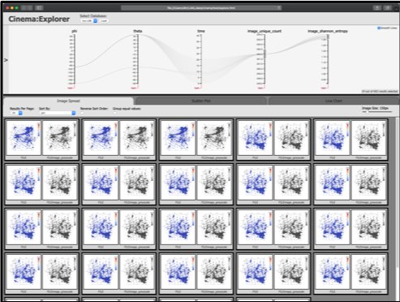

## End-to-end (Nxy/ASCENT/Cinema) Workflow

   

This is a demonstration of an end-to-end pipeline that performs GPU-enabled distributed environment in situ data analysis and visualization using the ECP ExaSky application Nyx. Using ECP ALPINE in situ infrastructure [ASCENT](https://github.com/Alpine-DAV/ascent), the pipeline accesses the appropriate Nyx simulation data and performs data sub-sampling via ALPINE data-driven sampling algorithm. The adaptive spatial sampling algorithm prioritizes rare data values while selecting sample points. As a result, the important features in the data such as Halos in Nyx simulation are preserved. Finally, a Cinema database is generated in situ using ALPINE ASCENT containing data artifacts as renderings of the output sub-sampled data.

The output Cinema database is further processed in a post-processing phase. It takes as input a Cinema database produced by ASCENT as described above, computes several values on the images, and installs a Cinema viewer that includes a query on several variables.

The **task** for this workflow is to perform **a visual query**, and **quickly view and explore the results of the simulation, filtered by some computed values**. In this case, we use the `cinema` command line tool to compute the entropy and unique pixels of an image, and then view results constrained by ranges of the computed quantities. This can show us which images may be of interest, from the thousands of images that may be written into a Cinema database. 

This example can be easily adjusted to compute different quantities, and filter on different values, so it serves as a general example of a workflow that performs a visual query on a Cinema database.

# Cloning this Git repository.

This repository makes use of git submodules. Clone with the recursive option, or be sure to `git submodule init; git submodule update` before running.

# How to run

First, be sure you agree with the default choices in `env.sh`. Use `popper run` from base directory this git repo to build and run the experiment.

# Dependencies

- Must run on Summit
- Bash
- Popper version v2.3.0+ [link](https://falsifiable.us)
